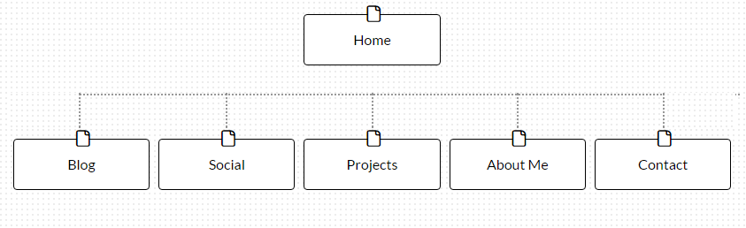

--What are the 6 Phases of Web Design?

As a general guideline, we define the six phases as: information gathering, planning, design, development, testing and delivery, and maintenance. These are not set in stone, but a new web developer would be wise to use these principles.

--What is your site's primary goal or purpose? What kind of content will your site feature?

The primary goal of my site is to showcase myself and the kind of work that I do. When it is finished, I hope to use my site as a sort of resume that potential employers could look at and get a feel for what I am capable of as well as what kind of person I am. In terms of content, there is going to be blog posts, past and current web design work, music production, links to my social media, an "about me" section, and lastly ways to contact me.

--What is your target audience's interests and how do you see your site addressing them?

My target audience is looking to learn more about me and to see if I would be a good fit for their project or job. My site addresses this by providing a full spectrum of work that I have done in a professional capacity. Of equal importance, this information is easily accessibile.

--What is the primary "action" the user should take when coming to your site? Do you want them to search for information, contact you, or see your portfolio? It's ok to have several actions at once, or different actions for different kinds of visitors.

I feel that I can divide the people who visit my site into those who wish to employ me and those who have seen something I have done and simply wish to learn more about me. For the former, I plan to provide a complete overview of my abilities on both a technical and artistic level. This visitor will look at my portfolio and "about me" section. After this, they can make an educated decision about whether or not I am a good fit for their project and contact me through the appropriate link on my home page. For the curious visitor, I hope that I can give them more of what attracted them in the first place. The curious visitor will hopefully take all possible actions that I have presented.

--What are the main things someone should know about design and user experience?

For design, the most important thing to know is that this is the first thing a visitor will use to judge your site. This means that if design is lacking, the user may be completely turned off and not even check out the content of your site. Additionally, you should design for a specific audience and make sure that you use prototypes to progress the main elements of your website. For user experience, it is important to break a site down in to subsystems where you know the user will interact with the site. This means that you need to examine each aspect of your site where the user is interacting with it, and identify if these are enjoyable, functional, and high performing. There is a lot of information out there on both of these topics, so anyone planning to build a web application should do research on both to understand how they should use them!

--What is user experience design and why is it valuable?

UX design is the process of planning out how a user will feel when they interact with a site. This discipline has many factors that play into it, such as the ergonomics/usability of the tools on a site as well as a user's system performance while on the site. UX design is important because at this point it has been extensively studied and good programmers can use scientific knowledge to enhance the user experience. When the user does not enjoy being on a site they are very likely to leave it quickly, an undesirable result.

--Which parts of the challenge did you find tedious?

This reflection! Articulating the ideas and concepts presented in this challenge was not easy. I really had to push myself to type this out, but now I definitely have a better understanding of what I have done here.