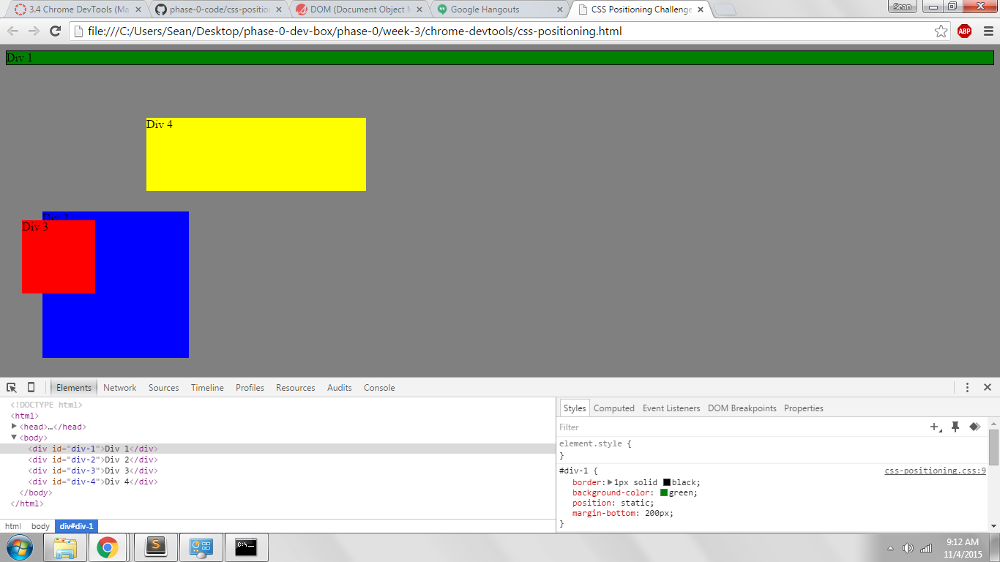
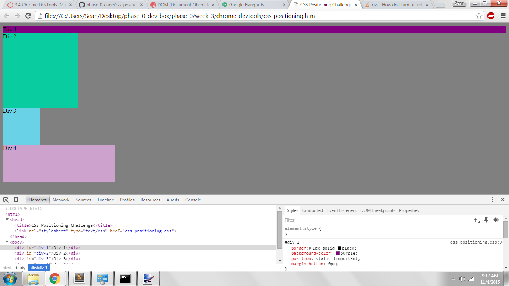
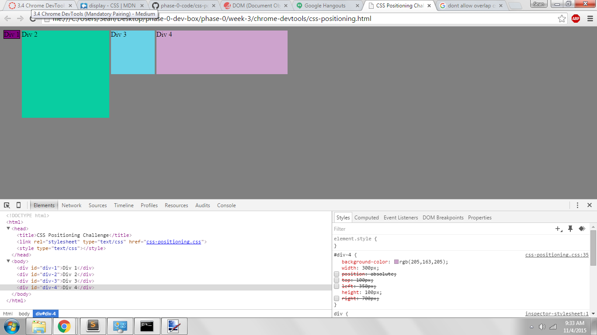
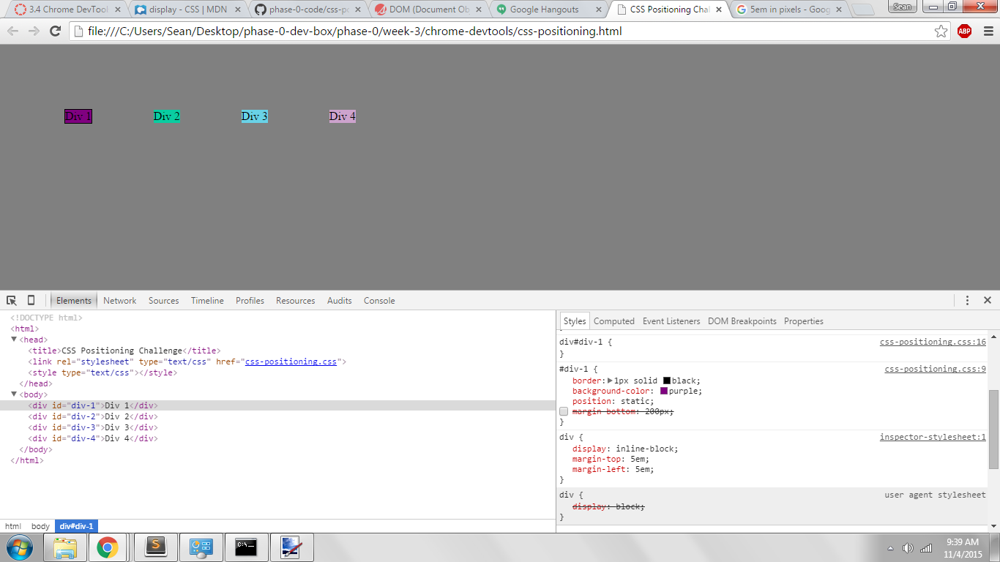
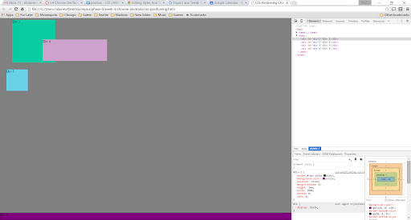
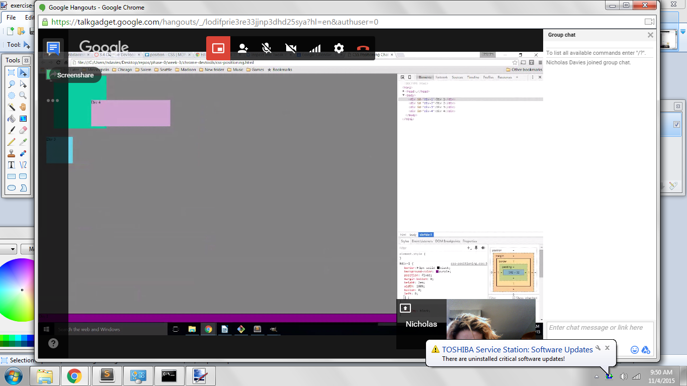
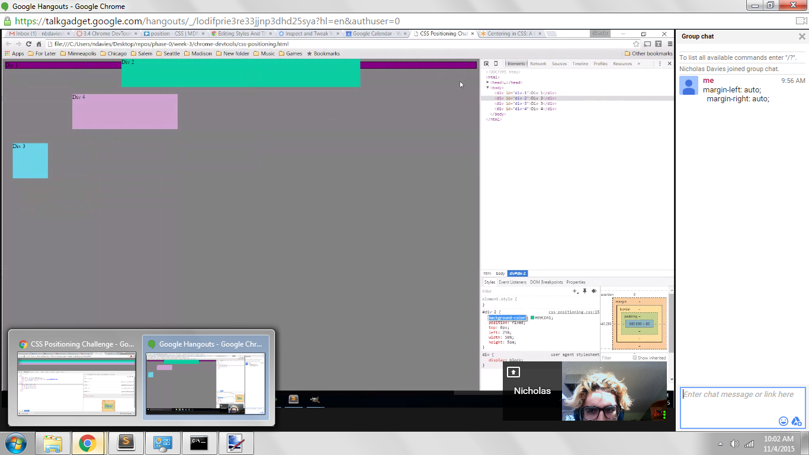
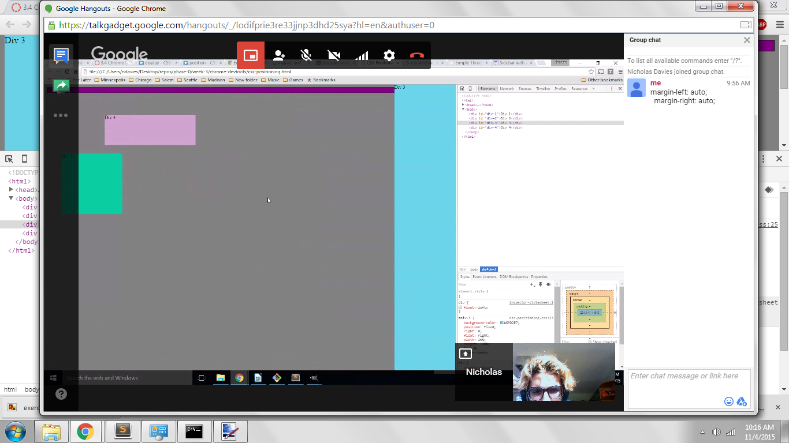
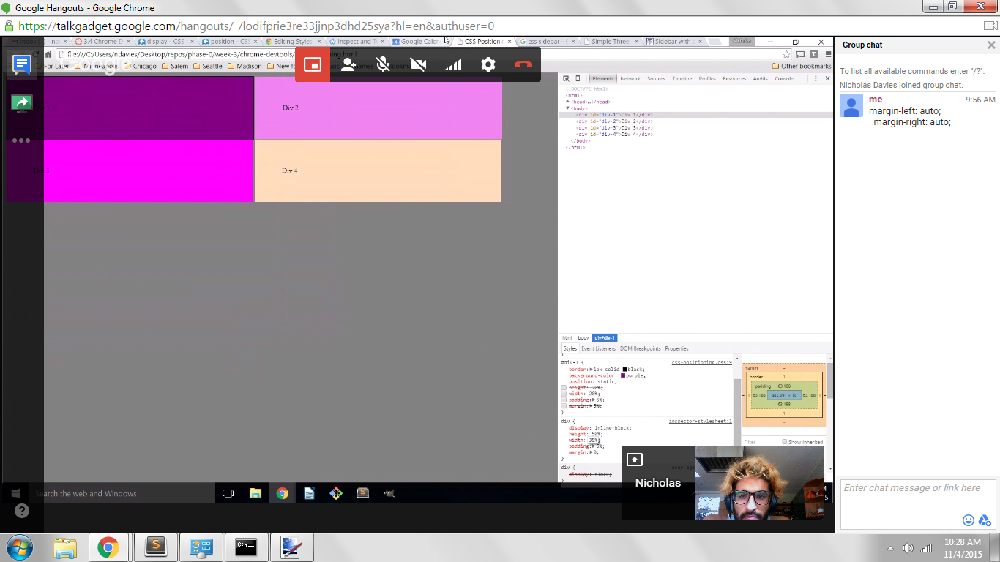

How can you use Chrome's DevTools inspector to help you format or position elements?

DevTools gives us a way to preview code in the browser. It is powerful because it allows us to make changes on the fly and get an idea for how things will look. As opposed to coding in a vacuum in Sublime, we get real, instantaneous feedback from a web browser.

How can you resize elements on the DOM using CSS?

There are a number of tools that we can use to resize elements. The "position" tag defines how an element with interact with other elements as well as the web page itself. We also can use "width" and "height" to give our elements fixed dimensions that will allow things to be spaced as we like. Additionally, we have the "top", "right", "bottom", and "left" tags to tell us how far from the edges of the page we want our elements.

What are the differences between absolute, fixed, static, and relative positioning? Which did you find easiest to use? Which was most difficult?

"fixed" means that an elements position never changes even if we scroll up and down a page. "relative" means that we have a default position for an element, and adjusting "top", "left", etc. will move this element away from the default. "static" means that our element can not be affected by "top", "left", etc. and it will simply go with the flow of the page. "absolute" means that the element is positioned relatively to its nearest ancestor, and if there is no nearest ancestor it will be positioned relative to the document body and will adjust with page scrolling. "static" was the easiest positioning element because it just goes with the flow. "absolute" was the hardest element because it relies on external factors.

What are the differences between margin, border, and padding?

These three properties provide the foundation for the box model of html elements; we define their dimensions and this allows us to space elements as we wish. The innermost property of the box model is the padding, a transparent layer around an html element that gives it some initial seperation from other elements. Next is the border, which surrounds the padding and the element itself, we can color and stylize this property in order to give our elements a visual outline. Similar to how the padding gives the element space, the margin gives the border seperation from other borders, if we wish.

What was your impression of this challenge overall? (love, hate, and why?)

I would describe this challenge as a necessary evil. It was very technical in nature and it made me a bit scared for when we begin making more advanced and dynamic web pages. However, formatting is really important and we have to make sure our html is displaying beautifull across all platforms!