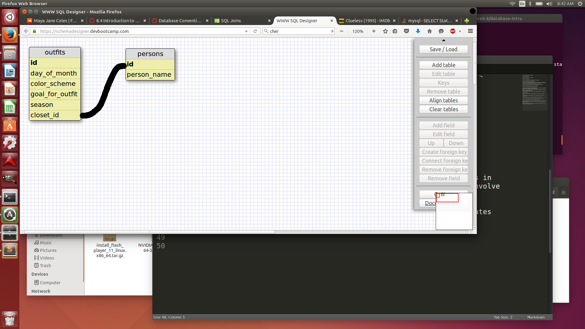

1. Select all data for all states.

SELECT * FROM states;

2. Select all data for all regions.

SELECT * FROM regions;

3. Select the state_name and population for all states.

SELECT state_name,population FROM states;

4. Select the state_name and population for all states ordered by population. 
The state with the highest population should be at the top.

SELECT state_name,population FROM states ORDER BY population DESC;

5. Select the state_name for the states in region 7.

SELECT state_name FROM states WHERE region_id=7;

6. Select the state_name and population_density for states with a population 
density over 50 ordered from least to most dense.

SELECT state_name,population_density FROM states WHERE population_density>50 
ORDER BY population_density ASC;

7. Select the state_name for states with a population between 1 million and 1.
5 million people.

SELECT state_name FROM states WHERE 1000000 < population AND population < 1500000;

8. Select the state_name and region_id for states ordered by region in 
ascending order.

SELECT state_name,region_id FROM states ORDER BY region_id ASC; 

9. Select the region_name for the regions with "Central" in the name.

SELECT region_name FROM regions WHERE id BETWEEN 4 AND 7;

10. Select the region_name and the state_name for all states and regions in 
ascending order by region_id. Refer to the region by name. (This will involve 
joining the tables).

SELECT regions.region_name,states.state_name FROM regions INNER JOIN states 
WHERE regions.id=states.region_id;

What are databases for?

Databases are generally used for storing large blocks of information that 
relate to one another in a variety of ways. They are a valuable tool for 
interacting with data sets which are too complex or large for other data 
structures like arrays and hashes.

What is a one-to-many relationship?

A one-to-many relationship is signified by some column value which relates to 
numerous values in a different column. For example, if we had some table "cars"
with columns "make" and "model", then following traditional car identifiers we 
would have a one-to-many relationship between "make" and "model".

What is a primary key? What is a foreign key? How can you determine which is 
which?

A primary key is used to identify rows within a table. A foreign key relates a 
table to another table by defining ids for its table rows and connecting 
these to the primary key, usually, of the other table.

How can you select information out of a SQL database? What are some general 
guidelines for that?

We use the SELECT statement to specify which column(s) we want. The FROM 
statement will allow us to specify which table our columns are located in. 
WHERE is a very valuable statement to filter results to be returned. 

