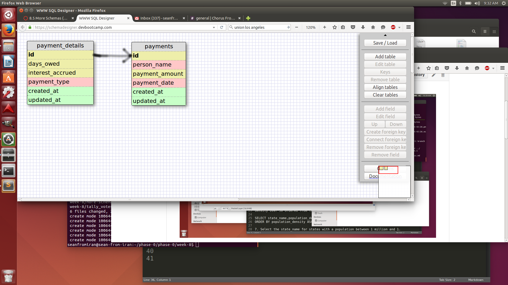
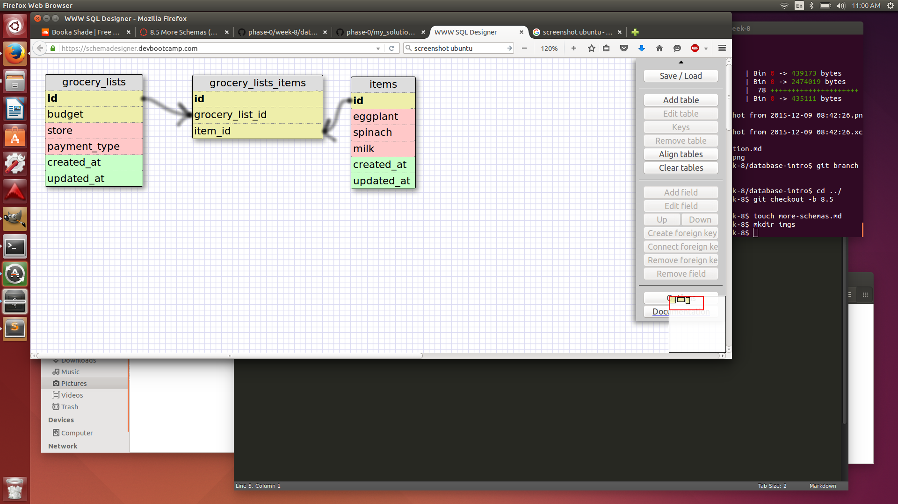

This relationship is one-to-one because every primary key for the payment 
details corresponds to one and only one primary key from payments.

What is a one-to-one database?

A one-to-one database is where we have the primary key of a table corresponding
to one and only one primary key of another table. This relationship is enabled 
by a foreign key which allows a table to access the information of a different 
table.

When would you use a one-to-one database? (Think generally, not in terms of 
the example you created).

We use this relationship when we have two tables which have two fields which 
we can pair together in exactly the same way. More specifically, for each 
entry in a field, we will have exactly one entry in the other field to which 
it relates.

What is a many-to-many database?

Two tables where both could have a one-to-many relationship with each other. 

When would you use a many-to-many database? (Think generally, not in terms of 
the example you created).

We use this relationship when we have two tables which both should have their 
own primary keys. At the same time, we want to relate these primary keys in 
some way so that both tables are connected.

What is confusing about database schemas? What makes sense?

Coming from a math background database schemas seem to generally follow the 
rules for injective and surjective functions, this makes it very understandable
for me.

